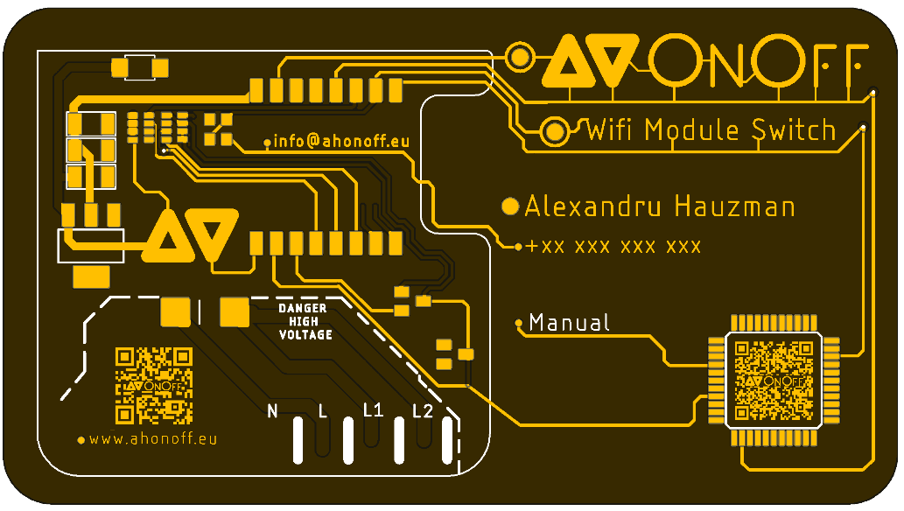

# PCB-Business-Card

**PCB Top**                       
:---------------------------:
  

# Resources

# QR Codes 

Ihave used [https://www.qrcode-monkey.com/](https://www.qrcode-monkey.com/) for generating QR codes.  There is option to modify the dot style and you can put a logo in the middle of the QR code.

# PCB Manufacturing 

This PCB is manufactured by [JLCPCB](https://jlcpcb.com/). 

*[ JLCPCB ](https://jlcpcb.com/) has the best price for PCB prototype with fast delivery, price stating from **5$ 4 Layer PCB 5 Pcs Size 50 x 50 mm**.*
* I have ordered this Card wit a thickens 1.0 Black color with ENIG-RoHS Surface Finish for a nice look.

*You can design your board using the free online editor or use the desktop version [ EasyEDA ](https://easyeda.com/).*